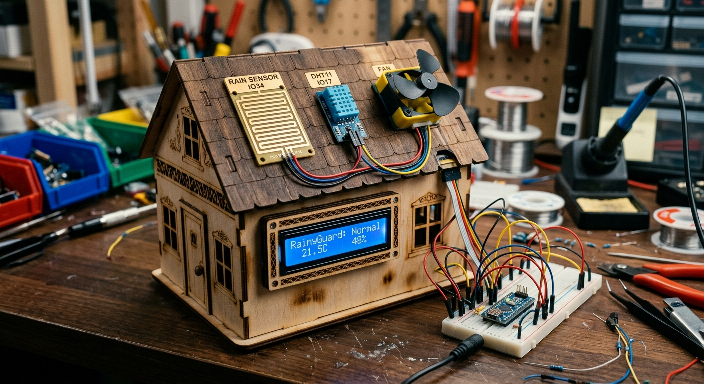
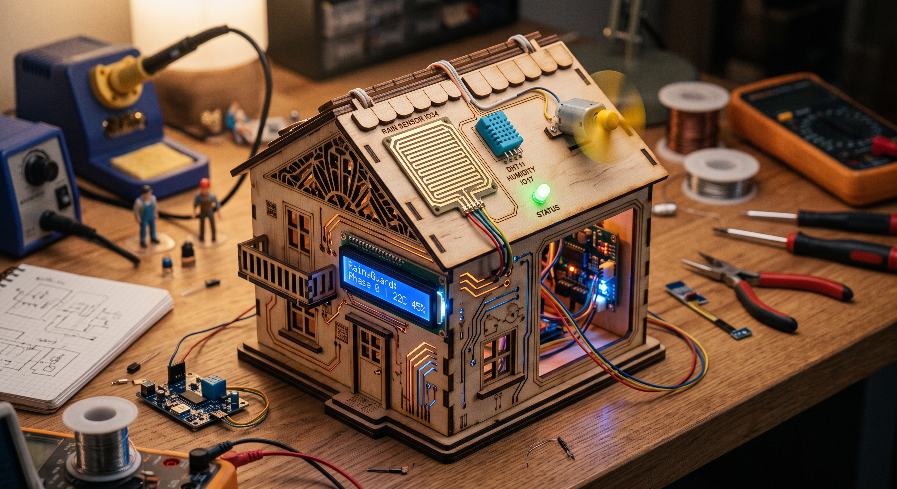
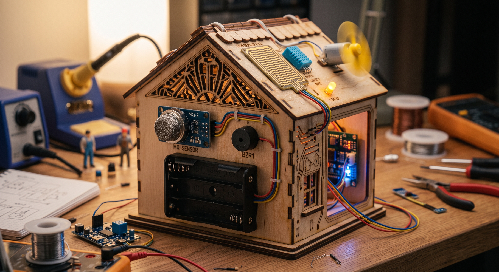

<p align="center">
  
</p>

<p align="center">
  <a href="https://www.espressif.com/en/products/socs/esp32"></a>
  <a href="https://en.wikipedia.org/wiki/C%2B%2B"></a>
  <a href="https://www.arduino.cc/"></a>
  
  
  <a href="https://github.com/Ri4ards2006/Rainyguard/releases"></a>
  <a href="LICENSE"></a>
  <a href="https://github.com/Ri4ards2006/Rainyguard/commits/main"></a>
</p>

<p align="center">
  <a href=""><b>Demo</b></a> ·
  <a href="#the-core-architecture"><b>Architecture</b></a> ·
  <a href="#get-started"><b>Quick Start</b></a>
</p>

**Autonomous environmental defense, zero cloud dependencies.** RainyGuard is an automated smart home defense station designed for a miniature house[cite: 1]. It continuously monitors the indoor climate and protects the structure from high humidity and sudden rain through a strict, multi-stage escalation process[cite: 1]. 

> **RainyGuard is a resilient embedded system you can deploy today.** Its primary goal is to shift smart home logic from delayed, cloud-dependent APIs back to local, instant hardware execution. By utilizing a strict protocol, it ensures your environment is ventilated when needed and locked down during critical weather events.

RainyGuard deliberately avoids complex networking overhead. There is **no SLA on API responses, and a hard guarantee on local execution**: the moment the roof-mounted analog rain sensor detects a drop[cite: 1], or the DHT11 crosses a humidity threshold[cite: 1], the system instantly transitions, adjusting DC fans[cite: 1], servo-driven windows[cite: 1], and alarms in milliseconds.

```C++ Serial Monitor (115200 baud)
[RainyGuard] Booting ESP32 Node...
✓ I2C Bus active @ 50kHz
✓ Sensors initialized
[FSM] Phase: 0 | Temp: 22.4 C | Humidity: 45.0 % | Rain ADC: 4095
[FSM] Phase: 3 | Temp: 22.4 C | Humidity: 45.0 % | Rain ADC: 1200
!! ALARM TRIGGERED: EMERGENCY RAIN LOCKDOWN !!
```

## See it running

<p align="center">
  
</p>
<p align="center"><em>The physical deployment: An ESP32 routing logic to a 16x2 I2C LCD, DHT11/22, and the roof-mounted analog rain sensor[cite: 1]. The UI provides instant <strong>Phase Status</strong> and environmental metrics[cite: 1].</em></p>

<p align="center">
  
</p>
<p align="center"><em>The <strong>Actuator Array</strong>: PWM-controlled DC fan for room ventilation[cite: 1] scaling with humidity, automated servo motor window control[cite: 1], and strict acoustic/visual alerts (LED & Buzzer)[cite: 1] tied to Phase 2 (Critical) and Phase 3 (Emergency).</em></p>

<p align="center">
  
</p>
<p align="center"><em>The <strong>Rear Module Array</strong>: Integrated MQ gas detection module, active acoustic buzzer[cite: 1], and direct power rail distribution.</em></p>

## The Core Architecture

With RainyGuard, hardware defense is not limited by Wi-Fi drops or server outages. It removes external dependencies by aggressively optimizing a functional, local state machine pipeline written in C++.

* **Deterministic FSM:** The system operates strictly within 4 defined escalation phases (Normal, Ventilation, Critical, Emergency)[cite: 1].
* **Non-blocking I/O:** All sensor polling and actuator updates use `millis()`-based delta timing, preventing `delay()` bottlenecks and ensuring the system remains responsive.
* **Signal Stability:** The I2C bus is deliberately downclocked (50kHz) and pulled up to ensure maximum LCD stability in environments with electrical noise.
* **Isolated Utility Tools:** System diagnostics (like I2C scanning) are separated into a dedicated `tools/` directory, keeping the primary `Rainyguard.ino` compilation clean and focused.

## The Escalation Protocol

RainyGuard evaluates environmental data across a strict hierarchy. Limited logic changes output, never the core semantics.

| Phase | Thresholds (Example) | DC Fan[cite: 1] | Alert Systems[cite: 1] | Servo Window[cite: 1] |
|---|---|---|---|---|
| **0: Normal** | Hum < 60% & Dry | OFF | Disabled | Open |
| **1: Ventilation** | Hum 60% - 74% | 50% PWM | Slow LED pulse | Open |
| **2: Critical** | Hum ≥ 75% | 100% PWM | Fast LED + Beep | Open |
| **3: Emergency** | **Rain active** | **HALT (0%)** | Continuous Alarm | **LOCKED (Closed)** |

*Note: Phase 3 overrides all other phases. If rain is detected, ventilation is immediately halted to prevent pulling moisture inside, and the servo automatically closes the window[cite: 1].*

## Get started

You need the microcontroller and the component array[cite: 1]. The engine is a single `.ino` file designed for the ESP32.

### 1. Hardware Pinout
* **ESP32 MCU:** Core controller node[cite: 1]
* **Rain Sensor:** `IO34` (Analog/ADC)[cite: 1]
* **DHT11/22:** `IO17` (Digital One-Wire)[cite: 1]
* **Status LED:** `IO12` (Digital Out)[cite: 1]
* **PIR Sensor:** `IO14` (Digital In)
* **Gas Sensor (MQ):** `IO23` (Digital/Analog In)
* **Active Buzzer:** `IO25` (Digital Out)[cite: 1]
* **DC Fan Motor:** `IO18` (PWM) / `IO19` (DIR)[cite: 1]
* **I2C Display (16x2):** `IO4` (SDA) / `IO5` (SCL) @ `0x27`[cite: 1]

### 2. Software Setup
1. Clone the repository:
   ```bash
   git clone [https://github.com/Ri4ards2006/Rainyguard.git](https://github.com/Ri4ards2006/Rainyguard.git)

   Open Rainyguard.ino in the Arduino IDE.

Install the required libraries via the Library Manager:

DHT sensor library by Adafruit

LiquidCrystal_I2C by Marco Schwartz

Select ESP32 Dev Module as your board, set Upload Speed to 115200 (or 921600), and compile.

(Having display issues? Flash the standalone tools/i2c_scanner/i2c_scanner.ino to verify your hardware address).

License
MIT License. Feel free to fork, adapt, and deploy on your own hardware.
 

---
